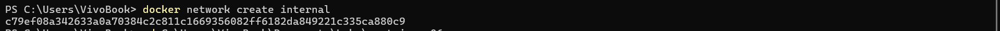
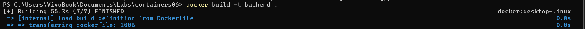
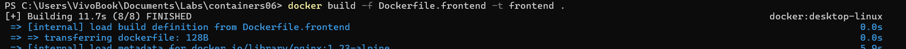
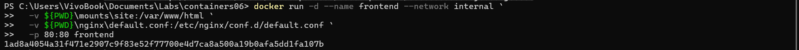
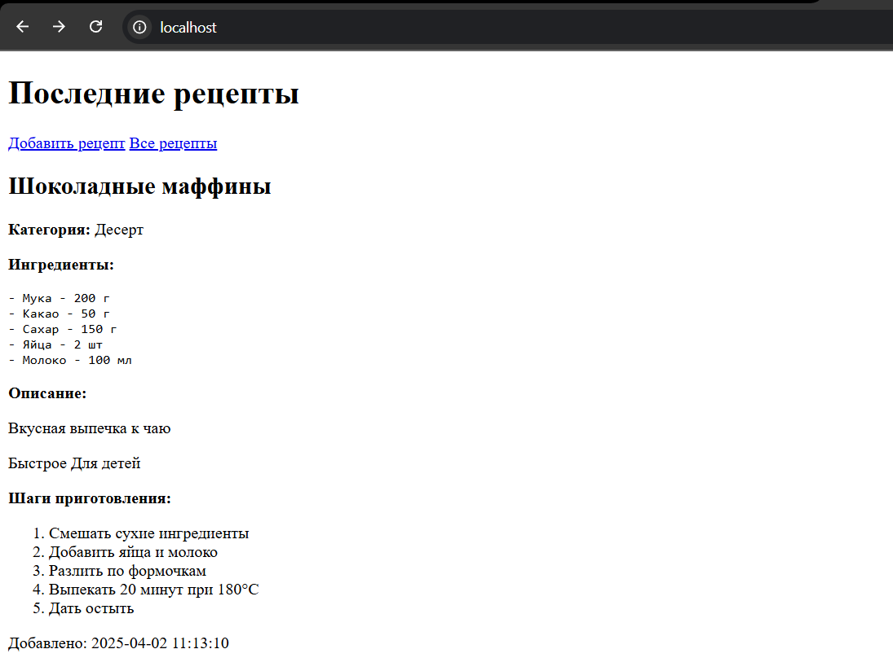

# Лабораторная работа №6: Взаимодействие контейнеров nginx и php-fpm

## Цель работы

Научиться управлять взаимодействием нескольких контейнеров, создавая связанное приложение на основе `nginx` и `php-fpm` в Docker.

## Задание

Создать PHP-приложение, работающее в двух контейнерах:
- `frontend`: контейнер с `nginx`, отдающий сайт и проксирующий PHP-запросы;
- `backend`: контейнер с `php-fpm`, обрабатывающий PHP-скрипты.

## Выполнение работы

### 1. Подготовка структуры проекта

Создан репозиторий `containers06` со следующей структурой:

```
containers06/
├── Dockerfile                   # Для backend
├── Dockerfile.frontend          # Для frontend
├── .gitignore
├── nginx/
│   └── default.conf             # Конфигурация nginx
├── mounts/
│   └── site/
│       └── public/
│           └── index.php        # Главная страница сайта
```

`.gitignore` содержит:
```gitignore
mounts/site/*
```

### 2. Сеть

Создана пользовательская сеть `internal`:

```bash
docker network create internal
```


### 3. Контейнер `backend`

Создан файл `Dockerfile`:

```Dockerfile
FROM php:7.4-fpm
WORKDIR /var/www/html
```

Сборка:

```bash
docker build -t backend .
```

Запуск:

```powershell
docker run -d --name backend --network internal `
  -v ${PWD}\mounts\site:/var/www/html `
  backend
```

### 4. Контейнер `frontend`

Файл `Dockerfile.frontend`:

```Dockerfile
FROM nginx:1.23-alpine
COPY nginx/default.conf /etc/nginx/conf.d/default.conf
```

Содержимое `nginx/default.conf`:

```nginx
server {
    listen 80;
    server_name _;
    root /var/www/html/public;
    index index.php;

    location / {
        try_files $uri $uri/ /index.php?$args;
    }

    location ~ \.php$ {
        fastcgi_pass backend:9000;
        fastcgi_index index.php;
        fastcgi_param SCRIPT_FILENAME $document_root$fastcgi_script_name;
        include fastcgi_params;
    }
}
```

Сборка:

```bash
docker build -f Dockerfile.frontend -t frontend .
```

Запуск:

```powershell
docker run -d --name frontend --network internal `
  -v ${PWD}\mounts\site:/var/www/html `
  -v ${PWD}\nginx\default.conf:/etc/nginx/conf.d/default.conf `
  -p 80:80 frontend
```

### 5. Проверка

Переход на [http://localhost](http://localhost) в браузере показывает страницу PHP-сайта.


---

## Ответы на вопросы

**1. Каким образом в данном примере контейнеры могут взаимодействовать друг с другом?**  
Контейнеры взаимодействуют через пользовательскую сеть `internal`. Контейнер `frontend` (nginx) обращается к `backend` (php-fpm) по его имени в сети — `backend`.

**2. Как видят контейнеры друг друга в рамках сети internal?**  
Контейнеры, подключённые к одной Docker-сети, могут обращаться друг к другу по имени контейнера. В конфигурации nginx указано `fastcgi_pass backend:9000;`, где `backend` — имя контейнера с php-fpm.

**3. Почему необходимо было переопределять конфигурацию nginx?**  
Стандартная конфигурация nginx не настроена на обработку PHP-файлов. Мы указали корень сайта (`root`), файл по умолчанию (`index.php`) и правила для проксирования `.php`-файлов на контейнер `backend`.

---

## Выводы

В ходе работы был развернут простой PHP-сайт, работающий в связке `nginx` и `php-fpm`, запущенных в отдельных Docker-контейнерах. Изучено взаимодействие контейнеров через общую сеть и настройка конфигурации nginx для проксирования PHP-запросов.
